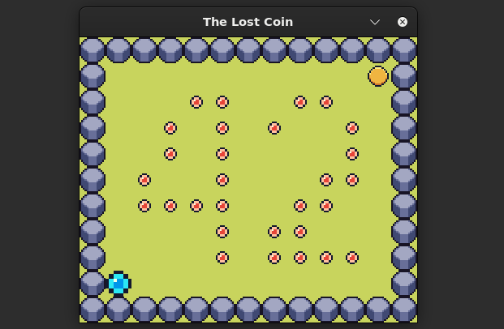

# so_long-42

The `so_long` project is a simple 2D game designed to make us use textures, sprites and some basic gameplay elements. The goal is to create an interactive game where the player navigates through a maze-like environment and collects items. In order to do that, I choose to use MinilibX as graphics library.

Score: **100%**

## Game

I created a simple game named `The Lost Coin`. The player (P) is a coin, your goal is to collects all the red gems (C). When you'll reach that goal, you will be able to exit the game by taking the blue exit door (E). Walls are represented by rocks (1) and can't be crossed, the coin can only roll in the grass (0).



- **Navigation**: Move the character in four directions (up W, down A, left S, right D).
- **Item Collection**: Gather items to earn points.
- **Map Display**: A visual representation of the maze is shown on the screen.
- **Game Over**: The game ends when the player collects all items and takes the exit door.

## Installation

To use so_long, simply clone the repository and compile it:

   ```bash
   git clone https://github.com/your-username/so_long-42.git
   make
   ./so_long <map>
   
